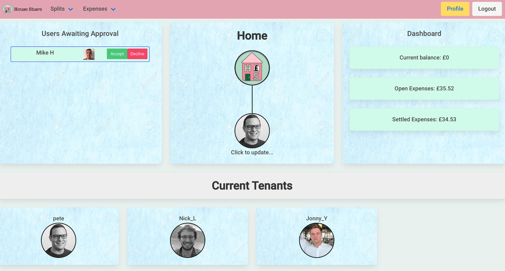
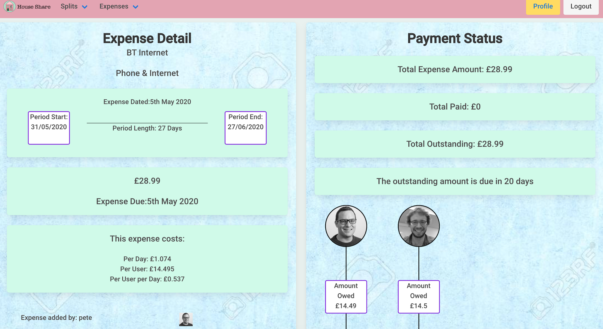
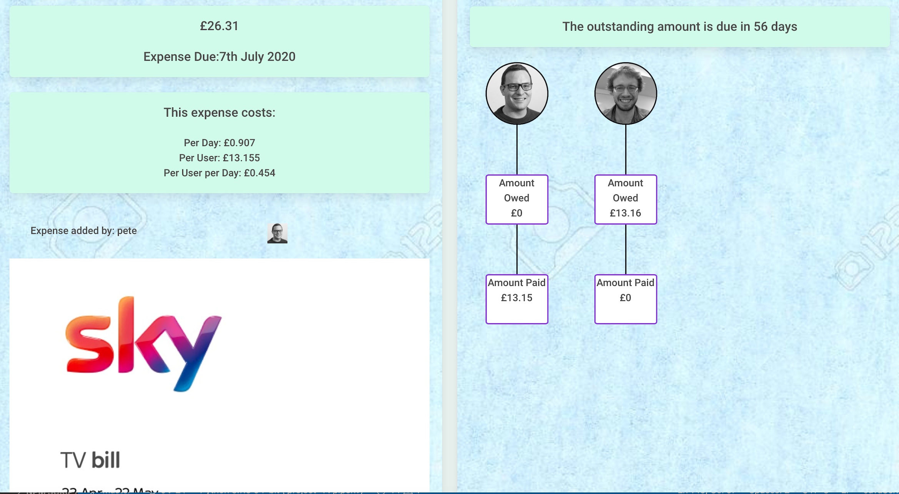
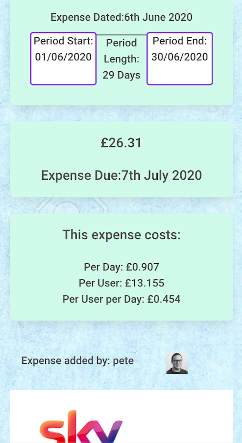
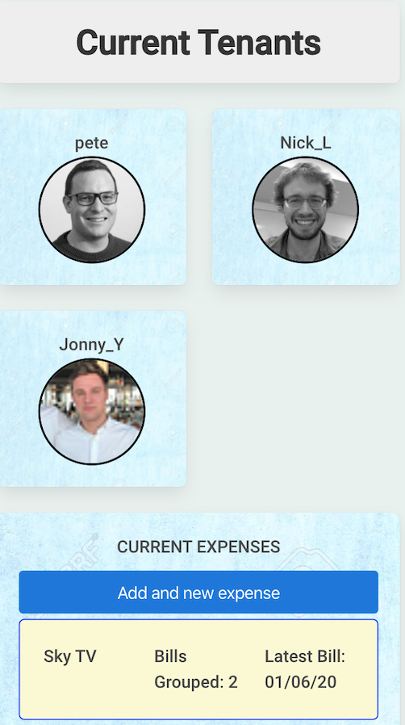
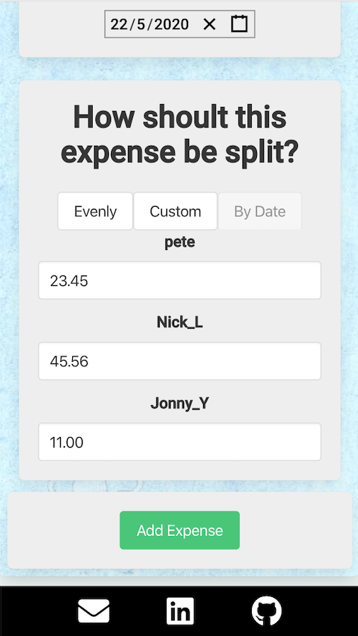
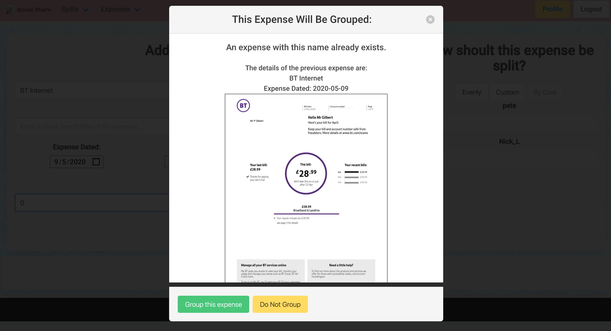
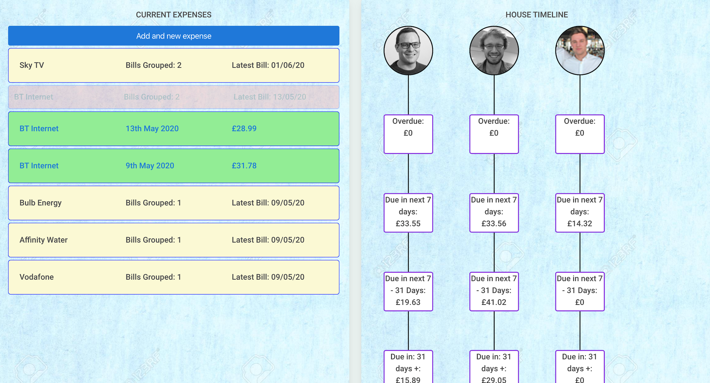
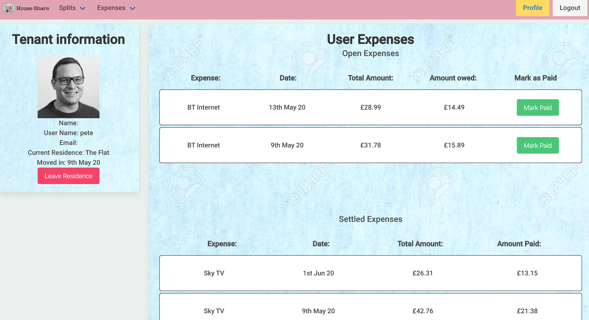
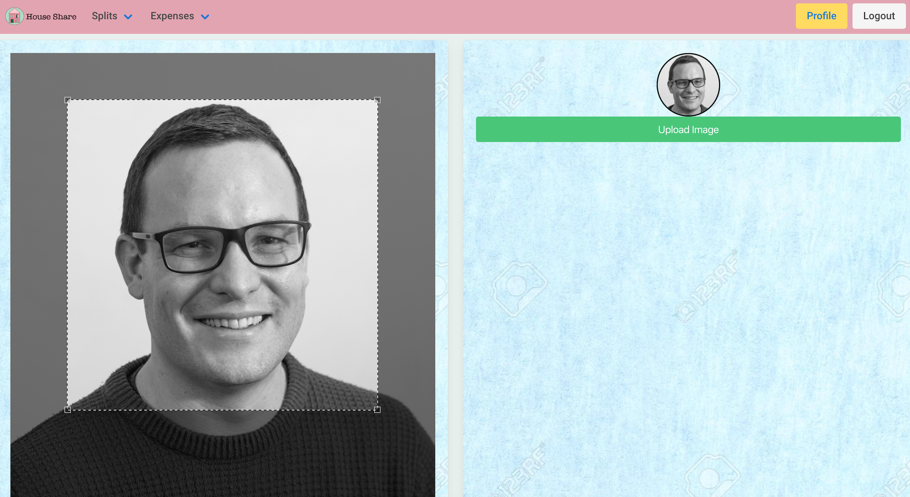

# Project-4 => House-Share

## Overview

House-Share is my first project using Django on the back end, and the final project of the General Assembly Software Engineering Immersive Course.

For this project I chose to work alone, and was challenged to build a full-stack application of my choice in one week.

After some though I decided to create an application that would allow users to sign up and create groups to split expenses between members of their house hold, and provide summaries and analysis of the current position of each member and the household as a whole.

You can view the project [here](https://m-house-s.herokuapp.com)

## The Brief

* **Build a full-stack application** by making your own backend and your own front-end from scratch
* **Use a Python Django API** using Django REST Framework to serve your data from a Postgres database
* **Consume your API with a separate front-end** built with React
* **Be a complete product** which most likely means multiple relationships and CRUD functionality for at least a couple of models

## The Technologies Used
* React
* JavaScript (ES6)
* Django
* Python
* HTML5
* CSS3
* Heroku
* Git and GitHub

## The Approach

For this application I started by implementing the required authentication and user classes to allow users to register and log in. For this I extended the Django Basic Auth classes with JWT Auth to issue and renew tokens. 

To this I added an image attribute and class to allow this information to be stored on the user model for convenience.

	class UpdateProfileViev(RetrieveUpdateDestroyAPIView):
	
	    queryset = User.objects.all()
	    serializer_class = UserImageSerializer
	
	    def put(self, request):
	      user = request.user
	      serializer = UserImageSerializer(user, data=request.data)
	      if serializer.is_valid():
	        serializer.save(update_fields=['image'])
	        return Response(serializer.data, status=HTTP_202_ACCEPTED)
	
	      return Response(serializer.errors, status=HTTP_422_UNPROCESSABLE_ENTITY)

Apart from the image, I also added name attributes to the model to allow them to be used later on in the application if needed.

	class User(AbstractUser):
	
	    first_name = models.CharField(max_length=20)
	    second_name = models.CharField(max_length=20)
	    image = models.ImageField(upload_to='profile_image', null=True)
	    

At this point I left the user model as the remaining information would be stored in other models, which is discussed in more detail below.

## The Models

One of the most important parts of this project was to get the models right, and I am fairly happy with the result, although in hindsight there are some changes I would make which I will discuss in the 'Lessons Learnt' section further down.

In total, outside of the User model, I had 6 models, most of which were related with the 'Residence' model which was used to keep track of the expense groups.

This model can be seen below.

	class Residence(models.Model):
	  short_name = models.CharField(max_length=30, unique=True)
	  address = models.ForeignKey(Address, related_name='residences', null=True, on_delete=models.CASCADE)
	  tenants = models.ManyToManyField(User, related_name='residences')
	  past_tenants = models.ManyToManyField(User, related_name='past_residences')
	  admin_user = models.ForeignKey(User, related_name='residence', on_delete=models.CASCADE)
	  join_requests = models.ManyToManyField(User, related_name='new_residence')
	
	
	  def __str__(self):
	    return f'{self.short_name}'
	    

Taking this approach allowed me to quickly retrieve data to return to the user in a single object, however as users are able to leave residences (when they move out for example), I used 2 other models for the expenses and the splits.

### The 'Expense' Model

Within the expenses model I decided to make the majority of the fields optional to make it as easy as possible for the user to input an expense, whilst giving the option to input more data to provide better and more in depth analytics if required. 

The Expense model can be seen below.

	class Expense(models.Model):
	  company_name = models.CharField(max_length=40)
	  description = models.CharField(max_length=200, blank=True)
	  expense_dated = models.DateField()
	  date_from = models.DateField(null=True)
	  date_to = models.DateField(null=True)
	  amount = models.FloatField()
	  payment_due_date = models.DateField(null=True)
	  image = models.ImageField(upload_to='bill_image', null=True)
	  residence = models.ForeignKey(Residence, related_name='expenses', on_delete=models.CASCADE)
	  # users_liable = models.ManyToManyField(User, related_name='expenses', blank=True)
	  admin_user = models.ForeignKey(User, related_name='expense', on_delete=models.CASCADE)
	
	  def __str__(self):
	    return f'{self.company_name}'

### The 'Splits' Model
	    
Held separately to the Expenses are the user splits, detailing how the expenses are split between users. Taking this approach gave me more flexibility when I needed to to access all expenses a user was liable for without revealing any newer or older expenses of groups they were associated with. 

This model also held the information on whether the user had paid the expense or not, held as a Boolean value on the 'paid_flag' attribute.
	

	class Split(models.Model):
	  expense = models.ForeignKey(Expense, related_name='splits', on_delete=models.CASCADE)
	  user = models.ForeignKey(User, related_name='splits', on_delete=models.CASCADE)
	  percentage_to_pay = models.FloatField()
	  paid_flag = models.BooleanField()
	  admin_user = models.ForeignKey(User, related_name='split', on_delete=models.CASCADE)
	
	  def __str__(self):
	    return f'{self.user.username}, at {self.residence.short_name}, is paying for {self.percentage_to_pay}% of this Expense'
	    
	    
## The Back End

Away from the models it was also important to get the serializers and views implemented correctly, and I certainly learnt a lot about this as I moved through the project.

One of the most important aspects of the application was to allow users to quickly enter expenses, and to mark them as paid. For this reason there were two Django views that were particularly important, both from a UX and security point of view. These were allowing users to input expenses and splits in one go, and to be able to mark splits as paid.

The view for the splits and marking them as paid is below.

	class SplitListView(ListCreateAPIView):
	    queryset = Split.objects.all()
	    serializer_class = SplitSerializer
	
	<!--CHECK PERMISSIONS FOR USER OR ADMIN-->
	
	    permission_classes = (isOwnerOrAdminOrReadOnly),
	
	    def get(self, request):
	      splits = Split.objects.all()
	      serializer = PopulatedSplitSerializer(splits, many=True)
	      return Response(serializer.data)
	
	    def post(self, request):
	      serializer = SplitSerializer(data=request.data)
	      if serializer.is_valid():
	        serializer.save()
	        return Response(serializer.data, status=HTTP_201_CREATED)
	
	      return Response(serializer.data, status=HTTP_422_UNPROCESSABLE_ENTITY)
	    
	    # This is used for marking an expense as paid, and should be limited for use by the split user or admin user. It then returns the split and the detail user view to update the page
	    
	    def put(self, request):
	      split = Split.objects.get(pk=request.data['id'])
	      
	      <!--CHECK USER HAS PERMISSIONS OR IS GROUP ADMIN-->
	      
	      self.check_object_permissions(request, split)
	      
	      serializer_f = SplitSerializer(split, data=request.data)
	      if serializer_f.is_valid():
	        serializer_f.save()
	        user = User.objects.get(id=request.data['user'])
	        serializer = PopulatedUserViewSerializer(user)
	        
	        <!--RETURN RESPONSE-->
	        
	        return Response({ 'user_profile': serializer.data, 'split': serializer_f.data }, status=HTTP_202_ACCEPTED)
	
	      return Response(serializer_f.errors, status=HTTP_422_UNPROCESSABLE_ENTITY)
	

One issue that had to be addressed here is the potential for one user to leave the group, or potentially not be updating the app properly, and so an additional permission class was implemented, which was 'isOwnerOrAdminOrReadOnly'. This ensures that groups would not be left with incomplete data, and if this was the case it could be corrected by the group admin.

### Handling multiple splits

The other really important aspect was allowing users to input an expense and have all the splits created automatically, and this was handled by the below Django view. 

The 'post' method for this can be seen below.

	def post(self, request):
	
	<!--SET THE ADMIN USER FOR THE EXPENSE TO THE USER CREATING IT-->
	
	      request.data['admin_user'] = request.user.id
	      
	      <!--CHECK THERE ARE SPLITS ASSOCIATED WITH THE EXPENSE-->
	      
	      if request.data['splits']:
	        f_serializer = ExpenseSerializer(data=request.data)
	        if f_serializer.is_valid():
	          f_serializer.save()
	          splits = request.data['splits']
	          print(splits)
	          new_data = []
	          
	 <!--ITERATE OVER THE SPLIT DATA TO SET NEWLY CREATED EXPENSE AND ADMIN USERS ON SPLIT MODEL --!>
	          for split in splits:
	            split['expense'] = f_serializer.data['id']
	            split['admin_user'] = f_serializer.data['admin_user']
	
	<!--SERIALIZE, SAVE -->
	            serializer = SplitSerializer(data=split)
	            if serializer.is_valid():
	              serializer.save()
	
	<!--COLLECT RESPONSE AND RETURN -->
	              new_data.append(serializer.data)
	          return Response({ 'Split': new_data, 'Expense': f_serializer.data }, status=HTTP_201_CREATED)
	        return Response(f_serializer.errors, status=HTTP_422_UNPROCESSABLE_ENTITY)
	      return Response({'message': 'There must be at least one split attributed to this Expense' }, status=HTTP_422_UNPROCESSABLE_ENTITY)

This approach allowed for the user to implement the expense as easily as possible, and for all associated users to be updated at the same time.

### Additional Permissions

Another concern to be handled on the back-end was validating who could view a users information, and although the below works I am not completely happy with it, as it is not a very efficient algorithm. For the purpose of this application though, and the limited amount of groups a user will be a part of, it is acceptable for the moment.

This permission class checks that the user that is attempting to be viewed is currently in residence with the current user, and if so allows them to view the more detailed user information.

	class isCurrentlyInResidenceWithUser(BasePermission):
	
	  def has_object_permission(self, request, view, obj):
	    current_user = request.user
	    residences = current_user.residences.all()
	    for residence in residences:
	      tenants = residence.tenants.all()
	      for tenant in tenants:
	        if tenant == obj:
	          return True

## The Front End

The front end for this application was built using React, and revolves around three main components. The Home page, which displays general information about the household group. The 'Expense Detail' page, for reviewing a single expense, and the user profile page where users are able to review and mark expenses. Screenshots of these can be seen below.

In order to keep track of the expense the pages use a series of functions that can be re-used, and make heavy use of 'moment' for dates.

For example the below function takes 4 arguments (user, tenant, lower date range, greater date range), and returns the amount of money owed within the provided time frame.

	amountDueInDays(user, tenant, lessThanDays, greaterThanDays) {
	    let amount = 0
	    user.residences[0].expenses.map(expense => {
	      const daysUntilDue = (Moment(expense.payment_due_date).diff(Moment(new Date()), 'days'))
	      if (daysUntilDue > greaterThanDays && daysUntilDue < lessThanDays) {
	        expense.splits.map(split => {
	          if (split.user.id === tenant.id && split.paid_flag === false) {
	            amount += split.percentage_to_pay
	          }
	        })
	      }
	    })
	    return amount
	  }

This function can then be passed down in props and/or rendered in the views as required for the page, as shown below.

	 

	            

	              
Due in next 7 days:

	              
£{(amountDueInDays(user, tenant, 8, -1)).toLocaleString('en')}

	            

	            

	            

	              
Due in next 7 - 31 Days:

	              
£{(amountDueInDays(user, tenant, 32, 7)).toLocaleString('en')}

	            

	            
	            
For this project I tried to use as much re-usable code as possible and make sure i was following DRY principles.

### Expense input form
Another particularly important page, especially from a UX point of view was the expense input page, and i spent a lot of time on this. 

This allows users to input an expense which is automatically split evenly between the current group members. If the expense is not exactly divisible by the amount of members, the positive or negative difference is allocated to the user inputting the expense. 

The user also has the option to split the expense in custom amounts. Before the form is submitted the data is validated and useful errors are shown to the user if there are any. The user is then redirected to a page where they can add an image to the expense if they would like.

### Automatic Expense Grouping

Another feature of the form input is the ability to group expenses with the same name. This is done automatically, but is flagged to the user and they are given the option not to group the expense if for any reason they don't want to. If they do not then a unix timestamp is added to the name to differentiate it in the views. Ideally i would like to change this to make it look a little better, but with the deadline for submission approaching I did not have time to go back and improve this. 

An example of the Expense Grouping Modal shown to the user, a non grouped expense, and the grouped expense view is below.

### Marking Expenses as paid

The user can also mark expenses as paid, which is how the application then knows what the status of each expense and group is, so this information can be calculated for all users.

In all the views there are simple functions used to ensure as expenses are moved between 'unpaid' and 'paid', that they are always displayed in date order:

	function sortByDate(splits) {
	    const newSplits = splits.map(split => {
	      split.expense_dated = new Date(split.expense_dated)
	      return split
	    })
	    const sortedSplits = newSplits.sort((a, b) => b.expense_dated - a.expense_dated)
	    return sortedSplits
	  }

### Image Uploads

As I wanted to use the uploaded user images for several views around the site, it was important these were always square, so that i could convert these to round images. In order to do this I used React-Crop to provide some additional functionality and a separate page to allow users to crop and upload pictures.

This code was taken from the React-crop documentation, and although it required a few amendments to get it to work properly in the way I needed, there are elements of using a canvas that I have still not got completely to grips with and will be spending more time on this in future.

	getCroppedImg(image, crop, fileName) {
	    const canvas = document.createElement('canvas')
	    const scaleX = image.naturalWidth / image.width
	    const scaleY = image.naturalHeight / image.height
	    canvas.width = crop.width
	    canvas.height = crop.height
	    const ctx = canvas.getContext('2d')
	    console.log(image)
	
	    ctx.drawImage(
	      image,
	      crop.x * scaleX,
	      crop.y * scaleY,
	      crop.width * scaleX,
	      crop.height * scaleY,
	      0,
	      0,
	      crop.width,
	      crop.height,
	    )
	
	    return new Promise((resolve, reject) => {
	      canvas.toBlob(blob => {
	        blob.name = fileName
	        resolve(blob)
	      }, 'image/jpeg', 1)
	    })
	  }

## Further Development

Taking this further there are some elements that need development. Currently a lot of the validation for uploading expenses and images is done completely on the front end, and before this app was used in the real world I would want to implement the remaining back end validations that i did not have time to do in the original time frame. This would be especially important for the image uploads which could not only cause invalid data, but could cause bigger issues for the server.

The second part of further development I would like to do is to implement the pages for users to upload details and images of spare rooms they available, which other users can then search and find. The models on the back end are implemented for this, but i did not have time to create the React pages and views.

Another useful feature to develop would be stricter validation around date ranges. Currently users can enter multiple grouped bills that can overlap in date range. Although this may sometimes be intended i would like to check that with the user to provide better analytics back to the group on monthly and annual expenses.

## Challenges

One of the challenges was to get the serializers set up correctly to provide only the required information back to the user in each situation. Currently there are situations where a lot of information is provided that is not needed, and in the long term this could become very inefficient when it is not needed. In order to completely solve this I would have needed more time to create considerably more end-points, and this is something I did not have time to do within the time limit for the project.

Another challenge was implementing the 'by date' function on the expense input form, and this is still not working correctly. The issue is that the needed information is not available in the initial user object, and so I need to have a look at amending the expense serializer to provide this for use by the form if needed.

## Successes

One of the biggest successes of this project was getting to grips with the Django framework. Luckily I had some prior experience using Ruby on Rails when I was programming as a hobby, and although there are some considerable differences with Django, overall I think this really helped with understanding some of the same methodologies used.

I am also very happy with the way this app looks on mobile, and throughout the whole process developed for mobile first, and I am very happy with how this turned out. This has not always been the case with past projects and so I wanted to make sure this app was completely usable on both mobile and desktop.

Another success is a simple one, but getting to grips with using 'Moment' was a huge help in this project, where dates were so important. In previous projects I had not used this as I just wasn't aware of how useful it was, and going forwards I will not forget it.

## Lessons Learnt

One of the main lessons from this project, especially in Django is around using the Base User object. Although it is incredibly useful for things like authorisation, it also has its limitations, and I ended up re-structuring some of the models to avoid putting attributes on the User model. In hindsight I would create a 'User Profile' model and relate it to the user, and use this to store all the additional user information I wanted in one place.

The second lesson is to make the choice between using React Hooks or React Classes and stick to one. As I was still learning about hooks as I was working on this project I have used a mixture of both, and I realise this is not ideal and for clarity I should always be consistent with one or the other.

